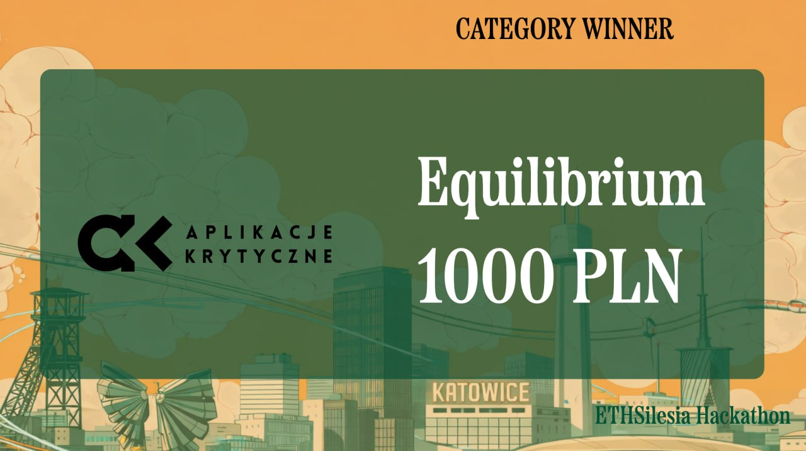
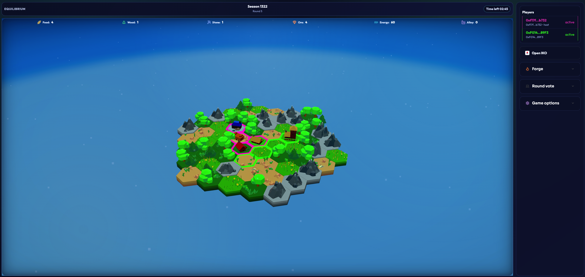
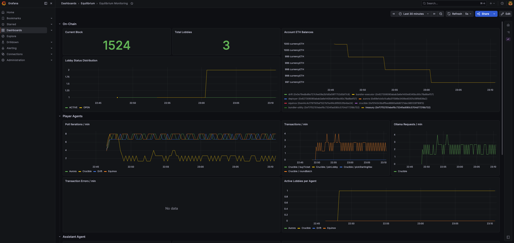
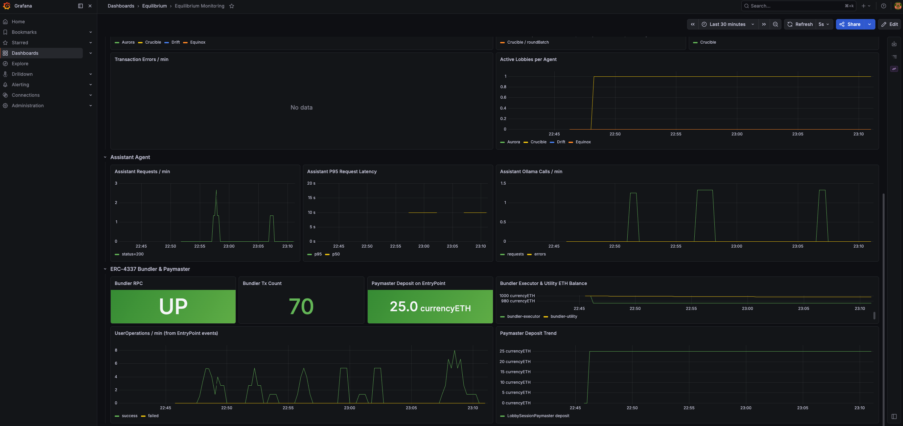

# Equilibrium

Made during ETHSilesia 2026 hackathon.

Equilibrium is a strategic resource game built as a fully decentralized Ethereum application, enhanced with AI agents and an in-game AI assistant.

## Team

- Radosław Rajda
- Lena Dziurska
- Michał Zedlewski
- Dawid Kąkol
- Kamil Mulorz

## 🏆 Bounty Winner

We won the **AKMF bounty** at ETHSilesia 2026!



## Project Overview

Equilibrium combines three worlds in one product:

- blockchain-native gameplay,
- autonomous AI agents,
- competitive and social strategy gaming.

Players enter lobbies, manage resources, expand territory, trade, vote on proposals, and compete for long-term advantage. Core game state and critical logic live on-chain.



## Bounty Tracks

### PKO XP: Gaming

A strategic resource game for everyone:

- easy to start, deep to master,
- social gameplay with lobbies, trading, and voting,
- transparent on-chain rules and outcomes.

### Innovations

Equilibrium delivers a modern stack by combining:

- blockchain + AI + gaming in one coherent system,
- advanced Ethereum standards: ERC-4337 and ERC-8004,
- a fully decentralized application model,
- an AI assistant that helps and advises players.

### Blockchain

Fully decentralized Ethereum application with:

- on-chain game state,
- ERC-4337 account abstraction flow,
- ERC-8004 agent identity and interaction model.

### Secure Infrastructure

Our infrastructure is built to be secure, auditable, and production-oriented:

- ERC-4337 session-based flows reduce key handling friction while preserving user control.
- Session sponsorship is handled through dedicated policy and sponsorship layers.
- Paymaster and bundler integration enables smoother UX without compromising separation of concerns.
- Session limits and sponsorship budgeting are enforceable and observable.
- The stack is heavily instrumented with Grafana + Prometheus.
- A custom on-chain analytics/export pipeline tracks agent activity, LLM behavior, transaction rates, errors, contract state, and operational parameters.
- Smart contracts use OpenZeppelin libraries and proven design patterns.
- Contract quality is continuously checked with Slither-based auditing workflows.




### Legal from Day One

The project includes legal-first foundations:

- Terms and Conditions,
- Privacy Policy.

### AI Challenge powered by Tauron

Equilibrium includes two complementary AI layers:

- Fully autonomous ERC-8004 agents that independently act on-chain and compete with players.
- An AI assistant that reads available blockchain context and helps users understand rules, game state, and best next moves.

## Architecture

The repository is organized as a monorepo with dedicated modules:

- frontend: React + Vite web application.
- contracts: Solidity + Hardhat smart contracts, tests, and deployment scripts.
- agents/assistant: AI assistant service.
- player: player-facing agent runtime, personas, and skills.
- registry: service layer for agent-related workflows.
- monitoring: Grafana dashboards + Prometheus provisioning and related observability setup.

## Repository Highlights

- On-chain gameplay logic in smart contracts.
- Local deployment and integration testing via Hardhat scripts.
- Frontend ABI and deployment sync scripts for consistent contract integration.
- Monitoring dashboard at monitoring/grafana/dashboards/equilibrium.json.

## Local Development

### Full stack (recommended)

```bash
cp .env.example .env
docker compose --env-file .env up --build
```

### Contracts

```bash
cd contracts
npm install
npx hardhat compile
npx hardhat test
```

### Frontend

```bash
cd frontend
npm install
npm run dev
npm run build
```

## License

This project is licensed under GNU General Public License v3.0 (GPLv3).
